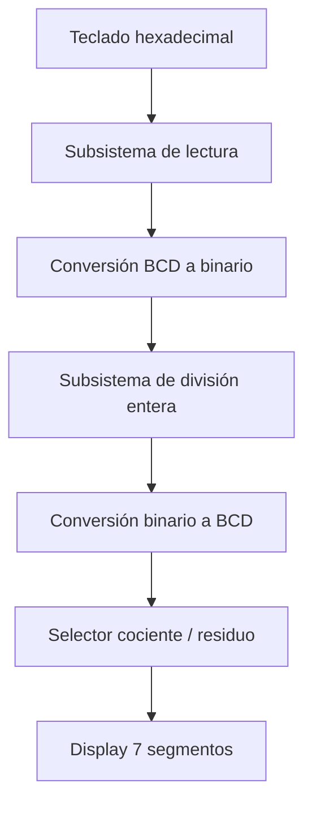
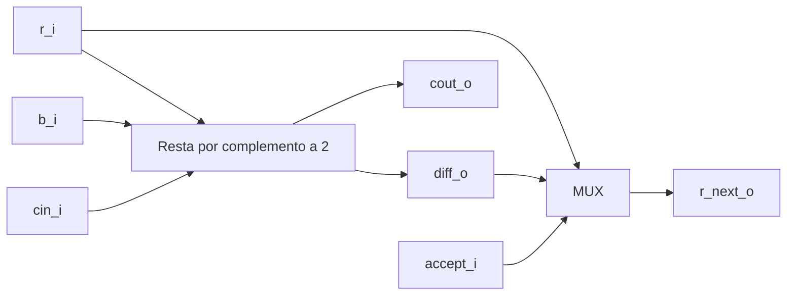
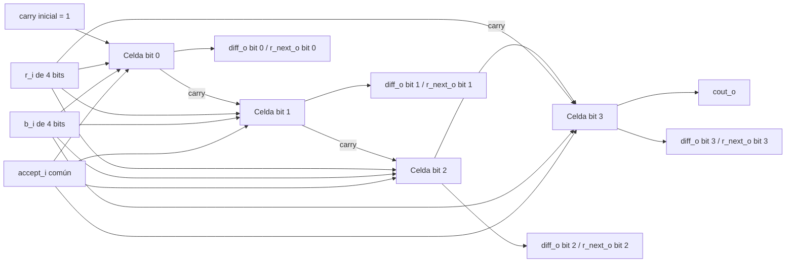

# Nombre del proyecto

## 1. Abreviaturas y definiciones
- **FPGA**: Field Programmable Gate Arrays

## 2. Referencias
[0] David Harris y Sarah Harris. *Digital Design and Computer Architecture. RISC-V Edition.* Morgan Kaufmann, 2022. ISBN: 978-0-12-820064-3

## 3. Desarrollo

### 3.0 Descripción general del sistema

### 3.1 Módulo 1
#### 1. Encabezado del módulo
```SystemVerilog
module mi_modulo(
    input logic     entrada_i,      
    output logic    salida_i 
    );
```
#### 2. Parámetros
- Lista de parámetros

#### 3. Entradas y salidas:
- `entrada_i`: descripción de la entrada
- `salida_o`: descripción de la salida

#### 4. Criterios de diseño
Diagramas, texto explicativo...

#### 5. Testbench
Descripción y resultados de las pruebas hechas

### Otros modulos
- agregar informacion siguiendo el ejemplo anterior.


## 4. Consumo de recursos

## 5. Problemas encontrados durante el proyecto

## Diagramas para informe

Diagrama general


Diagrama divider_cell

Celda básica de 1 bit que realiza una resta por complemento a dos y selecciona entre el resultado calculado o el residuo original según accept_i.

Diaframa divider_row

Fila de 4 bits construida a partir de varias celdas divider_cell conectadas en cascada, donde el acarreo se propaga entre celdas y se obtiene una resta completa del residuo parcial contra el divisor.

## Apendices:
### Apendice 1:
texto, imágen, etc
