# Nombre del proyecto

## 1. Abreviaturas y definiciones

* **FPGA (Field Programmable Gate Array):** Dispositivo lógico programable que permite implementar circuitos digitales mediante la configuración de bloques lógicos internos y recursos de interconexión.

* **SystemVerilog:** Lenguaje de descripción y verificación de hardware utilizado para modelar, simular e implementar los módulos desarrollados para el proyecto.

* **FSM (Finite State Machine):** Máquina de estados finitos utilizada para controlar la secuencia de operaciones y el flujo de datos dentro de un sistema digital.

* **Dividendo:** Número que será dividido durante la operación de división entera.

* **Divisor:** Número por el cual se divide el dividendo para obtener el cociente y el residuo.

* **Cociente:** Resultado entero obtenido al realizar una división.

* **Residuo:** Cantidad restante después de efectuar una división entera, cumpliendo que su valor es menor que el divisor.

* **Ruta crítica:** Camino combinacional más largo dentro de un circuito digital, el cual determina la frecuencia máxima de funcionamiento del sistema.

* **Multiplexor (MUX):** Circuito combinacional que selecciona una de varias entradas y la conecta a una única salida según una señal de control.

* **Flip-Flop (FF):** Elemento secuencial capaz de almacenar un bit de información sincronizado con una señal de reloj.

* **Tang Nano 9K:** Tarjeta de desarrollo FPGA utilizada para la implementación física y validación experimental del diseño.

* **Testbench:** Entorno de simulación utilizado para verificar el correcto funcionamiento de un módulo digital mediante la aplicación de estímulos y la observación de sus respuestas.


## 2. Referencias
[0] David Harris y Sarah Harris. *Digital Design and Computer Architecture. RISC-V Edition.* Morgan Kaufmann, 2022. ISBN: 978-0-12-820064-3

## 3. Introducción 
El diseño de sistemas digitales modernos requiere la implementación eficiente de algoritmos mediante circuitos lógicos secuenciales y combinacionales. A diferencia del software, donde las operaciones se ejecutan de forma secuencial por un procesador, en los sistemas digitales es necesario diseñar explícitamente la ruta de datos y la lógica de control que permitan realizar cada operación de manera correcta y sincronizada con una señal de reloj.

En este proyecto se desarrolla una unidad de división entera sin signo capaz de calcular el cociente y el residuo a partir de un dividendo de hasta 6 bits y un divisor de hasta 4 bits. La implementación se realiza utilizando SystemVerilog sobre una FPGA Tang Nano 9K, siguiendo los principios fundamentales del diseño digital sincrónico. El sistema integra diferentes subsistemas encargados de la lectura de datos desde un teclado hexadecimal, la conversión entre formatos numéricos, la ejecución del algoritmo de división y el despliegue de resultados en displays de siete segmentos.

La unidad de división se basa en el algoritmo iterativo de división presentado en el curso, el cual realiza una secuencia de restas parciales para determinar los bits del cociente y actualizar el residuo en cada etapa. Para garantizar un funcionamiento ordenado y facilitar la comunicación entre bloques, el diseño emplea señales de control tipo valid y done, además de registros que sincronizan el flujo de datos entre los diferentes subsistemas.

El desarrollo del proyecto permite aplicar conceptos fundamentales de diseño lógico, tales como máquinas de estados finitos (FSM), rutas de datos, diseño modular, verificación mediante simulación y análisis de temporización. Asimismo, proporciona experiencia práctica en la implementación de algoritmos aritméticos sobre hardware reconfigurable, considerando tanto aspectos funcionales como restricciones de rendimiento y utilización de recursos dentro de la FPGA.

## 4. Definición del problema y objetivos

### 4.1 Definición del problema

La implementación de operaciones aritméticas en hardware representa un desafío importante dentro del diseño de sistemas digitales, ya que requiere transformar algoritmos matemáticos en estructuras lógicas capaces de operar de forma sincronizada y eficiente. Entre estas operaciones, la división entera es particularmente relevante debido a que involucra múltiples etapas de cálculo y control, a diferencia de operaciones más simples como la suma o la resta.

El problema planteado en este proyecto consiste en diseñar e implementar una unidad de división entera sin signo capaz de recibir un dividendo decimal representable con un máximo de 6 bits y un divisor decimal representable con un máximo de 4 bits. El sistema debe calcular el cociente y el residuo de la operación utilizando el algoritmo de división estudiado en el curso, garantizando además una correcta interacción entre los diferentes subsistemas encargados de la captura de datos, el procesamiento y el despliegue de resultados.

La solución debe cumplir con los principios de diseño digital sincrónico, empleando registros, señales de control y una interfaz de comunicación basada en las señales *valid* y *done* para coordinar el flujo de datos entre módulos. Asimismo, el sistema debe ser implementado y verificado en una FPGA Tang Nano 9K utilizando SystemVerilog.

### 4.2 Objetivo general

Diseñar e implementar una unidad de división entera sin signo en una FPGA Tang Nano 9K, capaz de calcular el cociente y el residuo de una operación de división mediante el uso de SystemVerilog y técnicas de diseño digital sincrónico.

### 4.3 Objetivos específicos

* Implementar el algoritmo iterativo de división entera estudiado en el curso para obtener el cociente y el residuo de una operación aritmética.

* Diseñar una ruta de datos que permita realizar las operaciones de resta, desplazamiento y almacenamiento requeridas por el algoritmo de división.

* Implementar la lógica de control necesaria para coordinar el funcionamiento de los diferentes subsistemas mediante señales de control y sincronización.

* Integrar los módulos de lectura de datos, conversión numérica, división y despliegue dentro de un sistema digital completo.

* Verificar el correcto funcionamiento de cada módulo y del sistema integrado mediante testbenches y simulaciones funcionales.

* Analizar el consumo de recursos y el desempeño temporal del diseño implementado en la FPGA.

* Desplegar el cociente y el residuo obtenidos en displays de siete segmentos mediante los módulos de conversión y visualización desarrollados.

### 5.0 Descripción general del sistema

El sistema desarrollado implementa una unidad de división entera sin signo sobre una FPGA Tang Nano 9K. Su función principal consiste en recibir un dividendo y un divisor desde un teclado hexadecimal, ejecutar la operación de división y desplegar en displays de siete segmentos el cociente o el residuo obtenido.

El flujo de operación inicia en el módulo de lectura del teclado, el cual realiza el barrido de las filas, sincroniza las señales provenientes de las columnas y genera un código hexadecimal de 4 bits junto con una señal de validación. Posteriormente, el módulo de control de entrada interpreta las teclas ingresadas por el usuario y construye los valores correspondientes al dividendo y al divisor en formato binario.

Durante la captura de datos, las teclas numéricas de 0 a 9 son utilizadas para ingresar los dígitos decimales. La tecla `#`, codificada internamente como `4'hF`, se utiliza para confirmar la entrada actual y avanzar al siguiente paso del proceso. La tecla `*`, codificada como `4'hE`, permite borrar la información almacenada y reiniciar la captura de datos.

Una vez ingresados el dividendo y el divisor, el módulo de control genera una señal `valid` que inicia la operación de división dentro del subsistema `divider_core`. Este bloque encapsula un divisor combinacional basado en etapas sucesivas de resta y selección de residuo, entregando como resultado el cociente, el residuo y una señal `done` que indica que el resultado es válido y estable.

Después de completarse la división, el sistema permite visualizar el cociente o el residuo mediante una señal de selección. La tecla `D`, codificada como `4'hD`, conmuta entre ambas visualizaciones una vez que el resultado se encuentra disponible.

Finalmente, el resultado seleccionado se convierte a formato BCD y se envía al subsistema de despliegue, el cual utiliza multiplexado para controlar cuatro displays de siete segmentos. Mientras la división no haya finalizado, el sistema muestra el valor que el usuario se encuentra ingresando; cuando la operación concluye, se despliega automáticamente el resultado calculado.

El diseño se compone de los siguientes módulos principales:

| Módulo                         | Función principal                                                                                                      |
| ------------------------------ | ---------------------------------------------------------------------------------------------------------------------- |
| `keypad_reader.sv`             | Realiza el barrido del teclado hexadecimal, sincroniza las entradas y genera las señales `key_value` y `key_valid`.    |
| `input_controller.sv`          | Controla la captura del dividendo y divisor, valida los límites permitidos y genera la señal de inicio de la división. |
| `divider_cell.sv`              | Implementa la celda elemental de resta y selección utilizada por el divisor.                                           |
| `divider_row.sv`               | Construye una fila completa de resta mediante varias celdas `divider_cell` conectadas en cascada.                      |
| `divider_stage.sv`             | Ejecuta una etapa del algoritmo de división y genera un bit del cociente junto con el nuevo residuo parcial.           |
| `divider_comb.sv`              | Implementa el divisor combinacional completo utilizando varias etapas de división conectadas secuencialmente.          |
| `divider_core.sv`              | Encapsula el divisor combinacional dentro de una interfaz sincrónica basada en las señales `valid` y `done`.           |
| `result_selector.sv`           | Selecciona entre mostrar el cociente o el residuo calculado.                                                           |
| `bin_to_bcd.sv`                | Convierte los resultados binarios a formato BCD para su despliegue decimal.                                            |
| `display_hex_decoder.sv`       | Convierte cada dígito BCD en el patrón correspondiente para un display de siete segmentos.                             |
| `display_mux4.sv`              | Realiza el multiplexado de los cuatro displays.                                                                        |
| `display_result_controller.sv` | Coordina la selección, conversión y despliegue de los datos mostrados al usuario.                                      |
| `system_top.sv`                | Módulo superior que integra todos los subsistemas y coordina el flujo completo de operación.                           |

La Figura 1 muestra el diagrama general de interconexión del sistema desarrollado.

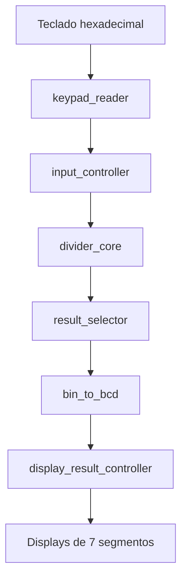
```mermaid
flowchart TD
    A[Teclado hexadecimal]
    B[keypad_reader]
    C[input_controller]
    D[divider_core]
    E[result_selector]
    F[bin_to_bcd]
    G[display_result_controller]
    H[Displays de 7 segmentos]

    A --> B
    B --> C
    C --> D
    D --> E
    E --> F
    F --> G
    G --> H
```

**Figura 1.** Diagrama general de bloques del sistema de división entera implementado.

## 6. Criterio de diseño

El diseño se realizó de manera modular con el objetivo de separar claramente la ruta de datos de la lógica de control. Esta estrategia facilita la verificación individual de cada subsistema, simplifica la depuración del proyecto y permite reutilizar módulos previamente desarrollados. En lugar de concentrar toda la funcionalidad en un único bloque, el sistema se dividió en subsistemas de lectura, captura de datos, división, selección de resultados y despliegue.

La captura de datos se implementó mediante un módulo de control encargado de interpretar las teclas ingresadas por el usuario y determinar si corresponden al dividendo, al divisor o a una instrucción de control. Este enfoque permite administrar de forma ordenada el flujo de operación del sistema, garantizando que los datos sean almacenados y procesados únicamente cuando se encuentran completos y son válidos.

Las señales provenientes del teclado hexadecimal son externas a la FPGA y, por lo tanto, asíncronas respecto al reloj interno de 27 MHz. Para reducir el riesgo de metaestabilidad, las entradas se sincronizan mediante registros antes de ser utilizadas por la lógica principal. Además, se implementó un mecanismo de bloqueo y liberación de tecla para evitar múltiples capturas producidas por una misma pulsación.

La operación de división se implementó utilizando una arquitectura jerárquica compuesta por celdas elementales de resta (`divider_cell`), agrupadas en filas (`divider_row`) y posteriormente en etapas de división (`divider_stage`). Esta organización permite construir el divisor completo a partir de bloques simples y fácilmente verificables. Cada etapa determina un bit del cociente y actualiza el residuo parcial mediante operaciones de resta y selección controlada.

Con el fin de cumplir los requisitos de sincronización entre subsistemas, el divisor combinacional fue encapsulado dentro de una interfaz registrada (`divider_core`). De esta forma, la operación se inicia mediante una señal `valid` y el resultado se entrega acompañado por una señal `done`, lo que permite desacoplar la lógica de cálculo de la lógica de control y garantizar que los datos de salida sean estables antes de ser utilizados por otros módulos.

Los resultados internos de la división se representan en formato binario, ya que este formato simplifica las operaciones aritméticas y reduce la complejidad del hardware. Sin embargo, debido a que la información debe mostrarse al usuario en formato decimal, se implementó un bloque de conversión de binario a BCD antes del subsistema de despliegue.

El despliegue de información se implementó mediante multiplexado de cuatro displays de siete segmentos. Esta técnica permite utilizar un conjunto compartido de líneas de segmentos mientras se activa un único display a la vez mediante las señales de ánodo. Gracias a la alta frecuencia de refresco generada por la FPGA, el usuario percibe todos los dígitos encendidos simultáneamente.

Finalmente, se incorporó un módulo de selección de resultados que permite alternar entre la visualización del cociente y el residuo una vez concluida la operación de división. Esta decisión evita la necesidad de utilizar displays adicionales y permite presentar toda la información requerida utilizando el mismo subsistema de visualización.


## 7. Subsistema de lectura del teclado hexadecimal

El módulo `keypad_reader` se encarga de leer un teclado hexadecimal de matriz 4×4. Para ello, genera un barrido periódico sobre las filas mediante la señal `filas[3:0]` y monitorea continuamente el estado de las columnas a través de la señal `columnas[3:0]`.

El teclado opera con lógica activa en bajo. En condiciones normales, todas las columnas permanecen en estado alto (`4'hF`). Cuando una tecla es presionada, la fila activa se conecta con una de las columnas, provocando que ésta cambie a nivel bajo. A partir de la combinación entre la fila activa y la columna detectada, el módulo determina el código hexadecimal correspondiente a la tecla presionada.

La salida principal del módulo está formada por una señal `key_value`, que contiene el código hexadecimal detectado, y una señal `key_valid`, que indica mediante un pulso de un ciclo de reloj que una nueva tecla válida ha sido capturada.

### 7.1 Funcionamiento interno

El módulo está compuesto por los siguientes elementos internos:

* **scan_cnt:** contador encargado de definir el tiempo durante el cual permanece activa cada fila del teclado.
* **fila_index:** registro que selecciona la fila actualmente activa durante el proceso de barrido.
* **columnas_ff1** y **columnas_sync:** registros utilizados para sincronizar las señales provenientes del teclado con el reloj interno de la FPGA.
* **key_code:** código hexadecimal obtenido a partir de la combinación fila-columna detectada.
* **key_valid:** pulso de validación generado cuando se detecta una nueva tecla.
* **locked:** bandera que impide múltiples capturas mientras una misma tecla permanece presionada.
* **release_cnt:** contador utilizado para verificar la liberación de la tecla antes de permitir una nueva detección.

La sincronización de las entradas externas mediante registros reduce el riesgo de metaestabilidad, mientras que el mecanismo de bloqueo evita que una única pulsación genere múltiples eventos de lectura.

### 7.2 Mapeo de teclas

La Tabla 1 muestra la correspondencia entre la fila activa, la columna detectada y el código hexadecimal generado por el módulo.

| Fila activa | Columna detectada | Tecla |
| ----------- | ----------------- | ----- |
| 1110        | 1110              | * / E |
| 1110        | 1101              | 0     |
| 1110        | 1011              | # / F |
| 1110        | 0111              | D     |
| 1101        | 1110              | 7     |
| 1101        | 1101              | 8     |
| 1101        | 1011              | 9     |
| 1101        | 0111              | C     |
| 1011        | 1110              | 4     |
| 1011        | 1101              | 5     |
| 1011        | 1011              | 6     |
| 1011        | 0111              | B     |
| 0111        | 1110              | 1     |
| 0111        | 1101              | 2     |
| 0111        | 1011              | 3     |
| 0111        | 0111              | A     |

Para el funcionamiento del sistema de división se utilizan principalmente los dígitos decimales de `0` a `9`. Adicionalmente, algunas teclas son empleadas como comandos de control:

* **# (4'hF):** confirma la entrada actual y permite avanzar al siguiente paso del proceso de captura.
* *** (4'hE):** reinicia o borra los datos almacenados.
* **D (4'hD):** permite alternar entre la visualización del cociente y el residuo una vez finalizada la división.

### 7.3 Diagrama del subsistema de lectura

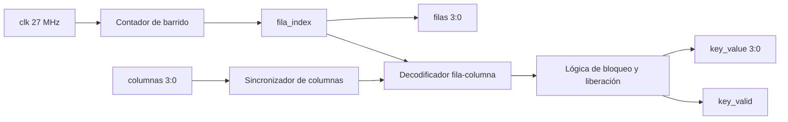
```mermaid
flowchart LR
    COL[columnas 3:0] --> SYNC[Sincronizador de columnas]
    CLK[clk 27 MHz] --> SCAN[Contador de barrido]
    SCAN --> FILA[fila_index]
    FILA --> FILAS[filas 3:0]

    SYNC --> DEC[Decodificador fila-columna]
    FILA --> DEC

    DEC --> LOCK[Lógica de bloqueo y liberación]
    LOCK --> KV[key_value 3:0]
    LOCK --> VALID[key_valid]
```

**Figura 1.** Diagrama de bloques del subsistema de lectura del teclado hexadecimal.

El subsistema de lectura constituye la interfaz principal entre el usuario y la FPGA. Su función es transformar las pulsaciones realizadas sobre el teclado en códigos digitales sincronizados y libres de rebotes, permitiendo que los módulos posteriores procesen la información de manera confiable.


## 8. Subsistema de control de entrada

El módulo `input_controller` se encarga de administrar el proceso de captura de datos y coordinar el inicio de la operación de división. Su función principal consiste en interpretar las teclas generadas por el módulo `keypad_reader`, construir los valores correspondientes al dividendo y al divisor, y generar la señal de validación que inicia el cálculo dentro del subsistema de división.

A diferencia del proyecto anterior, donde la lógica de control se utilizaba para almacenar dos operandos destinados a una suma, en este proyecto el controlador debe gestionar el ingreso secuencial de un dividendo y un divisor, verificando además que ambos valores se encuentren dentro de los límites establecidos por la especificación del diseño.

### 8.1 Captura del dividendo

Durante la primera etapa de operación, las teclas numéricas ingresadas por el usuario son utilizadas para construir el dividendo. Cada nuevo dígito se incorpora al valor previamente almacenado mediante operaciones de desplazamiento decimal, permitiendo ingresar números de varios dígitos de manera similar a una calculadora.

Mientras el dividendo se encuentra en proceso de captura, el sistema permanece a la espera de una señal de confirmación por parte del usuario. Cuando se presiona la tecla `#`, el controlador considera finalizada la entrada del dividendo y habilita la captura del divisor.

### 8.2 Captura del divisor

Una vez confirmado el dividendo, el controlador comienza a almacenar los dígitos correspondientes al divisor. El procedimiento de captura es similar al utilizado para el dividendo, permitiendo construir progresivamente el valor decimal a partir de las teclas ingresadas.

Cuando el usuario presiona nuevamente la tecla `#`, el controlador interpreta que ambos operandos han sido ingresados correctamente y procede a iniciar la operación de división.

### 8.3 Inicio de la división

Después de capturar los dos operandos, el módulo genera un pulso sobre la señal `valid`, indicando al subsistema `divider_core` que los datos de entrada son válidos y pueden ser procesados.

El dividendo y el divisor permanecen almacenados en registros internos mientras el bloque de división ejecuta el algoritmo correspondiente. De esta manera se garantiza que los datos permanezcan estables durante toda la operación.

### 8.4 Espera del resultado

Una vez iniciada la división, el controlador monitorea la señal `done` proveniente del módulo `divider_core`. Esta señal indica que el cociente y el residuo ya han sido calculados y registrados correctamente.

Mientras `done` permanece inactivo, el sistema continúa esperando la finalización de la operación. Cuando `done` se activa, el resultado queda disponible para ser enviado al subsistema de visualización.

### 8.5 Reinicio de la captura

El sistema permite reiniciar la captura de datos mediante la tecla `*`. Cuando esta tecla es detectada, los registros internos se limpian y el controlador retorna al estado inicial, permitiendo ingresar una nueva operación de división.

### 8.6 Diagrama de estados

La Figura 2 muestra el diagrama de estados utilizado por el subsistema de control de entrada.

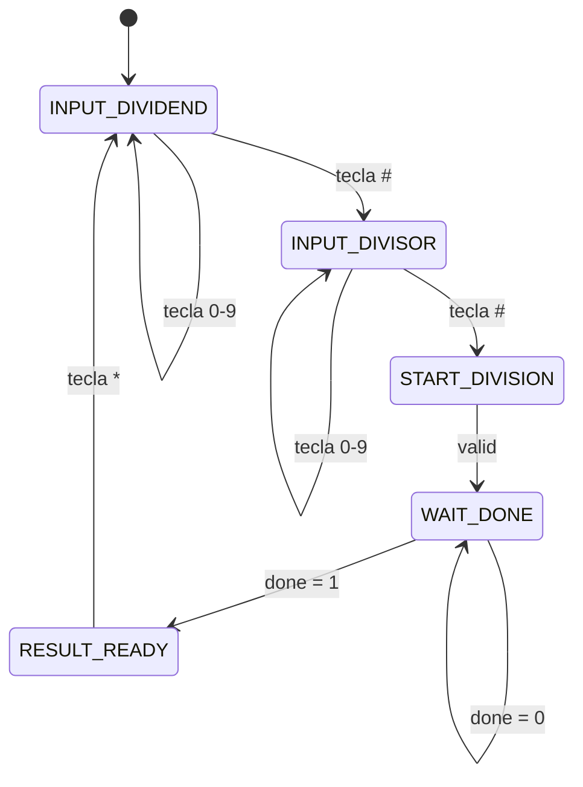
```mermaid
stateDiagram-v2
    [*] --> INPUT_DIVIDEND

    INPUT_DIVIDEND --> INPUT_DIVIDEND : tecla 0-9
    INPUT_DIVIDEND --> INPUT_DIVISOR : tecla #

    INPUT_DIVISOR --> INPUT_DIVISOR : tecla 0-9
    INPUT_DIVISOR --> START_DIVISION : tecla #

    START_DIVISION --> WAIT_DONE : valid

    WAIT_DONE --> WAIT_DONE : done = 0
    WAIT_DONE --> RESULT_READY : done = 1

    RESULT_READY --> INPUT_DIVIDEND : tecla *
```

**Figura 2.** Diagrama de estados del subsistema de control de entrada.

### 8.7 Diagrama del subsistema de control

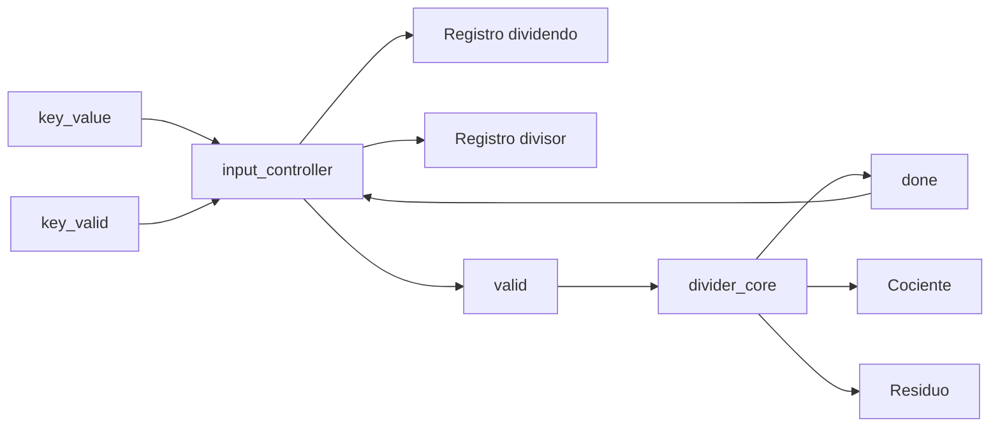
```mermaid
flowchart LR
    KV[key_value]
    VALID[key_valid]

    KV --> CTRL[input_controller]
    VALID --> CTRL

    CTRL --> DIVIDEND[Registro dividendo]
    CTRL --> DIVISOR[Registro divisor]

    CTRL --> V[valid]

    V --> DIVIDER[divider_core]

    DIVIDER --> D[done]

    D --> CTRL

    DIVIDER --> Q[Cociente]
    DIVIDER --> R[Residuo]
```

**Figura 3.** Diagrama de bloques del subsistema de control y captura de datos.

## 9. Subsistema de división entera

El subsistema de división entera es el bloque encargado de calcular el cociente y el residuo a partir del dividendo y divisor ingresados por el usuario. En este proyecto se trabaja con división entera sin signo, por lo que todos los operandos se interpretan como valores positivos.

El dividendo se representa mediante 6 bits, lo que permite valores desde 0 hasta 63. El divisor se representa mediante 4 bits, permitiendo valores desde 0 hasta 15. Como resultado, el sistema entrega un cociente de 6 bits y un residuo de 4 bits. Además, se incluye una señal de detección de división entre cero para identificar operaciones inválidas.

La división se implementa mediante una estructura jerárquica formada por los módulos `divider_cell`, `divider_row`, `divider_stage`, `divider_comb` y `divider_core`. Esta organización permite construir el divisor completo a partir de bloques pequeños, facilitando la verificación individual de cada etapa.

### 9.1 Principio de funcionamiento

El algoritmo utilizado se basa en el método de división binaria por restas sucesivas parciales. En cada etapa, se forma un residuo parcial y se intenta restar el divisor. Si la resta es válida, el resultado de la resta se acepta como nuevo residuo y se genera un bit de cociente igual a 1. Si la resta no es válida, se conserva el residuo anterior y el bit de cociente generado es 0.

La operación cumple la relación fundamental de la división entera:

```text
dividendo = divisor × cociente + residuo
```

donde el residuo debe ser menor que el divisor cuando la operación es válida.

### 9.2 Módulo `divider_cell`

El módulo `divider_cell` representa la celda elemental del divisor. Esta celda trabaja sobre un solo bit y se encarga de realizar parte de la resta por complemento a dos entre el residuo parcial y el divisor. Además, incluye una selección que permite escoger entre conservar el bit original del residuo o aceptar el bit calculado por la resta.

Sus señales principales son:

| Señal      | Función                                                 |
| ---------- | ------------------------------------------------------- |
| `r_i`      | Bit del residuo parcial de entrada.                     |
| `b_i`      | Bit del divisor.                                        |
| `cin_i`    | Acarreo de entrada utilizado en la resta.               |
| `accept_i` | Señal que indica si se acepta el resultado de la resta. |
| `diff_o`   | Bit resultante de la operación de resta.                |
| `cout_o`   | Acarreo de salida hacia la siguiente celda.             |
| `r_next_o` | Bit del nuevo residuo seleccionado.                     |

### 9.3 Módulo `divider_row`

El módulo `divider_row` agrupa varias celdas `divider_cell` conectadas en cascada. Su función es realizar una resta completa entre el residuo parcial y el divisor. El acarreo se propaga desde la celda menos significativa hasta la más significativa, permitiendo determinar si la resta puede aceptarse o no.

Este módulo genera como salida el resultado de la resta y el acarreo final. Dicho acarreo se utiliza posteriormente como señal de decisión para saber si el divisor cabe dentro del residuo parcial.

### 9.4 Módulo `divider_stage`

El módulo `divider_stage` representa una etapa completa del algoritmo de división. En esta etapa se intenta restar el divisor al residuo parcial. Si la resta no produce un resultado negativo, el nuevo residuo corresponde al resultado de dicha resta y el bit de cociente generado es 1. En caso contrario, se conserva el residuo anterior y el bit de cociente generado es 0.

Por lo tanto, cada `divider_stage` cumple dos funciones principales:

* Actualizar el residuo parcial.
* Generar un bit del cociente.

### 9.5 Módulo `divider_comb`

El módulo `divider_comb` implementa el divisor combinacional completo. Para ello, conecta varias etapas `divider_stage` en secuencia, procesando los bits del dividendo desde el más significativo hasta el menos significativo.

En cada etapa se incorpora un nuevo bit del dividendo al residuo parcial, se intenta realizar la resta con el divisor y se produce un nuevo bit del cociente. Al finalizar todas las etapas, el módulo entrega el cociente completo, el residuo final y la señal `div_zero_o`.

Sus principales señales son:

| Señal         | Función                                 |
| ------------- | --------------------------------------- |
| `dividend_i`  | Dividendo de entrada de 6 bits.         |
| `divisor_i`   | Divisor de entrada de 4 bits.           |
| `quotient_o`  | Cociente resultante de 6 bits.          |
| `remainder_o` | Residuo resultante de 4 bits.           |
| `div_zero_o`  | Bandera que indica división entre cero. |

### 9.6 Módulo `divider_core`

El módulo `divider_core` encapsula el divisor combinacional dentro de una interfaz sincrónica. Este bloque registra las entradas, ejecuta la división mediante el módulo `divider_comb` y registra las salidas antes de entregarlas al resto del sistema.

La operación inicia cuando la señal `valid_i` se activa. En ese momento, el módulo captura el dividendo y el divisor. Posteriormente, el resultado calculado se almacena en registros de salida y se activa la señal `done_o`, indicando que el cociente y el residuo se encuentran estables.

Este diseño permite que el subsistema de división se comunique de forma ordenada con los demás bloques del sistema mediante una interfaz tipo `valid/done`.

### 9.7 Diagrama del subsistema de división

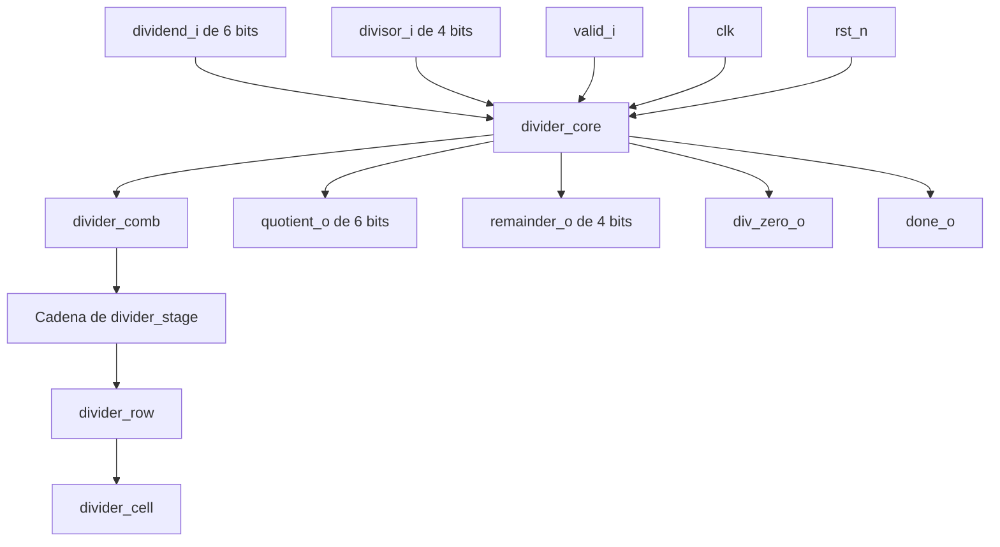
```mermaid
flowchart TD
    A[dividend_i de 6 bits] --> CORE[divider_core]
    B[divisor_i de 4 bits] --> CORE
    V[valid_i] --> CORE
    CLK[clk] --> CORE
    RST[rst_n] --> CORE

    CORE --> COMB[divider_comb]
    COMB --> STAGES[Cadena de divider_stage]
    STAGES --> ROWS[divider_row]
    ROWS --> CELLS[divider_cell]

    CORE --> Q[quotient_o de 6 bits]
    CORE --> R[remainder_o de 4 bits]
    CORE --> Z[div_zero_o]
    CORE --> D[done_o]
```

**Figura X.** Diagrama de bloques del subsistema de división entera.

## 10. Subsistema de despliegue en 7 segmentos

El subsistema de despliegue es el encargado de presentar al usuario la información generada por el sistema de división. Este bloque recibe el cociente y el residuo calculados por el subsistema de división y permite visualizar cualquiera de los dos resultados en cuatro displays de siete segmentos.

El despliegue está formado principalmente por los módulos `result_selector`, `bin_to_bcd`, `display_result_controller`, `display_mux4` y `display_hex_decoder`.

El módulo `result_selector` permite seleccionar cuál dato será mostrado en pantalla. Dependiendo de la señal de selección, el sistema puede desplegar el cociente o el residuo obtenido durante la operación de división. Esta funcionalidad permite reutilizar el mismo conjunto de displays para visualizar ambos resultados.

Una vez seleccionado el valor correspondiente, el módulo `bin_to_bcd` convierte el número binario a representación BCD. Esta conversión es necesaria debido a que los resultados internos de la división se almacenan en formato binario, mientras que los displays requieren dígitos decimales independientes para su correcta visualización.

Posteriormente, el módulo `display_result_controller` organiza los dígitos BCD obtenidos y los envía al sistema de multiplexado. El módulo `display_mux4` recibe cuatro dígitos de 4 bits (`d3`, `d2`, `d1` y `d0`) y selecciona cuál de ellos será mostrado en cada instante. Para ello utiliza un contador interno de refresco que determina cuál display debe activarse.

Finalmente, el módulo `display_hex_decoder` convierte cada dígito de 4 bits en el patrón correspondiente para los siete segmentos. Aunque este decodificador puede representar valores hexadecimales desde 0 hasta F, durante la operación normal del sistema se utilizan principalmente valores decimales de 0 a 9.

### 10.1 Multiplexado de los displays

La multiplexación permite controlar cuatro displays utilizando un único conjunto de líneas de segmentos. El sistema activa únicamente un display a la vez mediante las señales de ánodo y cambia rápidamente entre ellos, generando la percepción visual de que todos permanecen encendidos simultáneamente.

La selección de ánodos se realiza mediante lógica activa en bajo, según se muestra en la Tabla 2.

| Selector | Dígito mostrado | Ánodo activo |
| -------- | --------------- | ------------ |
| 00       | d3              | 1110         |
| 01       | d2              | 1101         |
| 10       | d1              | 1011         |
| 11       | d0              | 0111         |

### 10.2 Conversión binario a BCD

Los resultados producidos por el divisor se encuentran originalmente en formato binario. Para permitir una representación decimal comprensible para el usuario, el módulo `bin_to_bcd` realiza la conversión hacia cuatro dígitos BCD.

Esta conversión evita que el usuario deba interpretar directamente el resultado binario y permite utilizar el mismo sistema de despliegue decimal empleado en proyectos anteriores.

### 10.3 Selección entre cociente y residuo

Una vez finalizada la operación de división, el sistema permite alternar entre la visualización del cociente y el residuo. Esta funcionalidad es implementada por el módulo `result_selector`, el cual recibe ambos resultados y entrega únicamente el valor seleccionado hacia el bloque de conversión y despliegue.

Gracias a este mecanismo, es posible presentar toda la información requerida utilizando únicamente cuatro displays de siete segmentos.

### 10.4 Diagrama del subsistema de despliegue

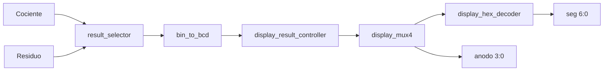
```mermaid
flowchart LR
    Q[Cociente]
    R[Residuo]

    Q --> SEL[result_selector]
    R --> SEL

    SEL --> BCD[bin_to_bcd]

    BCD --> CTRL[display_result_controller]

    CTRL --> MUX[display_mux4]
    MUX --> DEC[display_hex_decoder]

    DEC --> SEG[seg 6:0]
    MUX --> AN[anodo 3:0]
```

**Figura 5.** Diagrama de bloques del subsistema de despliegue multiplexado.

El subsistema de despliegue constituye la interfaz visual del proyecto, permitiendo al usuario observar de forma clara y directa los resultados generados por la unidad de división sin necesidad de interpretar valores binarios internos.

## 11. Interconexión general del sistema

El sistema completo se organiza como una ruta de datos controlada por el módulo `input_controller`. El flujo de operación inicia cuando el usuario ingresa información mediante el teclado hexadecimal. El módulo `keypad_reader` detecta las pulsaciones, realiza el barrido de filas y genera un código hexadecimal válido junto con una señal de validación.

Posteriormente, el módulo `input_controller` interpreta las teclas ingresadas y construye los valores correspondientes al dividendo y al divisor. Una vez que ambos operandos han sido capturados, este bloque genera la señal `valid`, que inicia el proceso de división dentro del módulo `divider_core`.

El subsistema de división recibe el dividendo y el divisor, ejecuta el algoritmo de división entera y produce como resultado el cociente, el residuo y la señal `done`, la cual indica que la operación ha finalizado correctamente. Los resultados generados son enviados al módulo `result_selector`, encargado de seleccionar cuál de los dos valores será mostrado al usuario.

El dato seleccionado se convierte posteriormente desde formato binario a BCD mediante el módulo `bin_to_bcd`. Finalmente, el subsistema de despliegue recibe los dígitos BCD, realiza el multiplexado de los displays y genera las señales necesarias para controlar los segmentos y ánodos de los cuatro displays de siete segmentos.

La Figura 6 muestra la interconexión general de todos los subsistemas que conforman el diseño.


```mermaid
flowchart LR
    K[Teclado hexadecimal]

    K --> KR[keypad_reader]

    KR -->|key_value, key_valid| IC[input_controller]

    IC -->|dividend, divisor, valid| DIV[divider_core]

    DIV -->|quotient, remainder, done| SEL[result_selector]

    SEL --> BCD[bin_to_bcd]

    BCD --> DISP[display_result_controller]

    DISP --> MUX[display_mux4]

    MUX --> DEC[display_hex_decoder]

    DEC --> SEG[Displays de 7 segmentos]
```

**Figura 6.** Diagrama general de interconexión del sistema de división entera.

La estructura modular utilizada permite verificar cada subsistema de manera independiente antes de integrarlos dentro del sistema completo. Además, la separación entre captura de datos, procesamiento y visualización facilita el mantenimiento del diseño y reduce la complejidad de depuración durante las etapas de simulación e implementación física.


**Diagrama general**
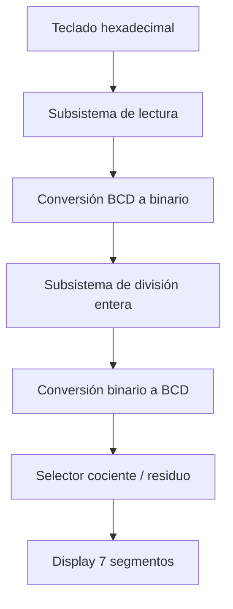
```mermaid
flowchart TD
    A[Teclado hexadecimal] --> B[Subsistema de lectura]
    B --> C[Conversión BCD a binario]
    C --> D[Subsistema de división entera]
    D --> E[Conversión binario a BCD]
    E --> F[Selector cociente / residuo]
    F --> G[Display 7 segmentos]
```

**Diagrama divider_cell**
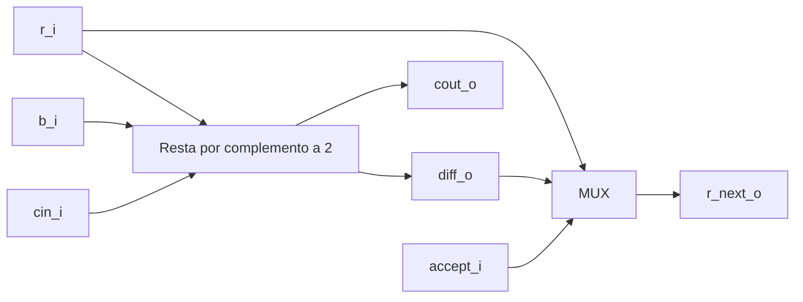
```mermaid
flowchart LR
    A[r_i] --> S[Resta por complemento a 2]
    B[b_i] --> S
    C[cin_i] --> S

    S --> D[diff_o]
    S --> E[cout_o]

    A --> M[MUX]
    D --> M
    F[accept_i] --> M
    M --> G[r_next_o]
```
Celda básica de 1 bit que realiza una resta por complemento a dos y selecciona entre el resultado calculado o el residuo original según accept_i.

**Diaframa divider_row**
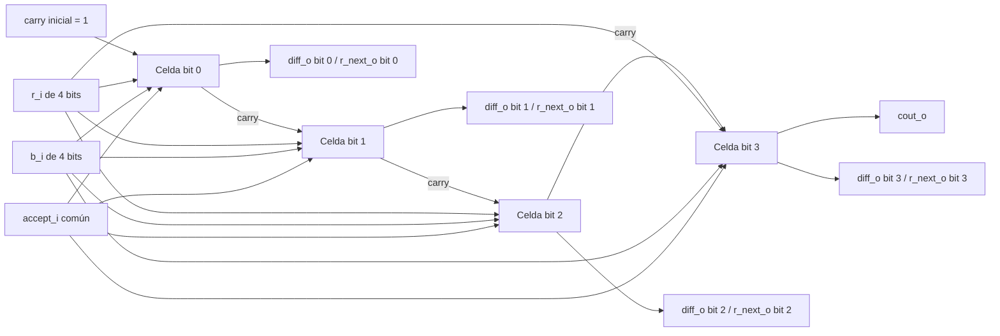
```mermaid
flowchart LR
    START["carry inicial = 1"] --> C0["Celda bit 0"]
    C0 -->|"carry"| C1["Celda bit 1"]
    C1 -->|"carry"| C2["Celda bit 2"]
    C2 -->|"carry"| C3["Celda bit 3"]
    C3 --> COUT["cout_o"]

    RI["r_i de 4 bits"] --> C0
    RI --> C1
    RI --> C2
    RI --> C3

    BI["b_i de 4 bits"] --> C0
    BI --> C1
    BI --> C2
    BI --> C3

    ACC["accept_i común"] --> C0
    ACC --> C1
    ACC --> C2
    ACC --> C3

    C0 --> D0["diff_o bit 0 / r_next_o bit 0"]
    C1 --> D1["diff_o bit 1 / r_next_o bit 1"]
    C2 --> D2["diff_o bit 2 / r_next_o bit 2"]
    C3 --> D3["diff_o bit 3 / r_next_o bit 3"]
```
Fila de 4 bits construida a partir de varias celdas divider_cell conectadas en cascada, donde el acarreo se propaga entre celdas y se obtiene una resta completa del residuo parcial contra el divisor.

**Diagrama divider_stage**
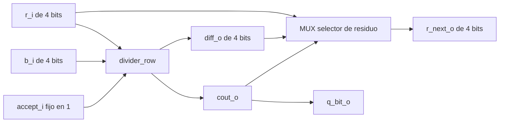
```mermaid
flowchart LR
    RI["r_i de 4 bits"] --> ROW["divider_row"]
    BI["b_i de 4 bits"] --> ROW
    ACC["accept_i fijo en 1"] --> ROW

    ROW --> DIFF["diff_o de 4 bits"]
    ROW --> COUT["cout_o"]

    RI --> MUX["MUX selector de residuo"]
    DIFF --> MUX
    COUT --> MUX

    MUX --> RNEXT["r_next_o de 4 bits"]

    COUT --> QBIT["q_bit_o"]
```
divider_stage representa una etapa de decisión del divisor. Internamente utiliza divider_row para intentar restar el divisor al residuo parcial, forzando accept_i en 1 para obtener el resultado de la resta. Luego, el acarreo final cout_o se utiliza como señal de decisión: si cout_o es 1, la resta fue válida y se acepta diff_o como nuevo residuo; si cout_o es 0, la resta no fue válida y se conserva el residuo anterior r_i. Esta misma señal se entrega como q_bit_o, correspondiente al bit del cociente generado por la etapa.

**Diagrama divisor completo**
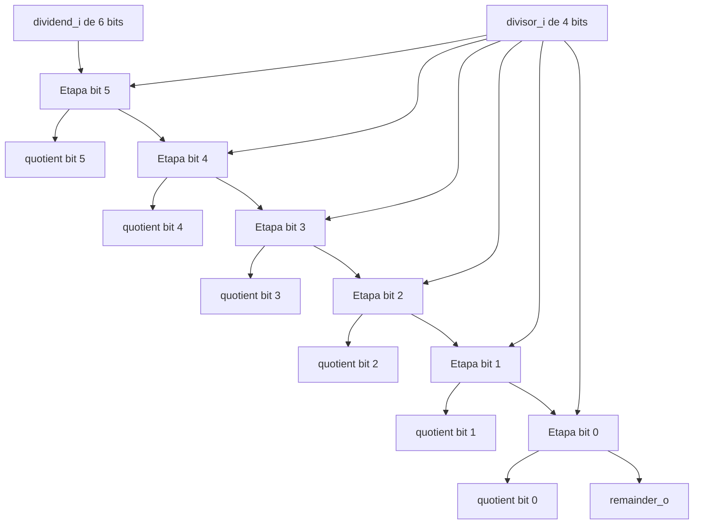
```mermaid
flowchart TD
    A["dividend_i de 6 bits"] --> S5["Etapa bit 5"]
    B["divisor_i de 4 bits"] --> S5
    S5 --> Q5["quotient bit 5"]
    S5 --> S4["Etapa bit 4"]

    B --> S4
    S4 --> Q4["quotient bit 4"]
    S4 --> S3["Etapa bit 3"]

    B --> S3
    S3 --> Q3["quotient bit 3"]
    S3 --> S2["Etapa bit 2"]

    B --> S2
    S2 --> Q2["quotient bit 2"]
    S2 --> S1["Etapa bit 1"]

    B --> S1
    S1 --> Q1["quotient bit 1"]
    S1 --> S0["Etapa bit 0"]

    B --> S0
    S0 --> Q0["quotient bit 0"]
    S0 --> R["remainder_o"]
```

**Diagrama divider_comb**
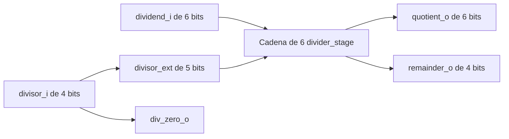
```mermaid
flowchart LR
    A["dividend_i de 6 bits"] --> B["Cadena de 6 divider_stage"]
    D["divisor_i de 4 bits"] --> E["divisor_ext de 5 bits"]
    E --> B
    B --> Q["quotient_o de 6 bits"]
    B --> R["remainder_o de 4 bits"]
    D --> Z["div_zero_o"]
```
El módulo divider_comb implementa un divisor combinacional sin signo para un dividendo de 6 bits y un divisor de 4 bits. Internamente utiliza seis módulos divider_stage conectados en secuencia, uno por cada bit del dividendo, desde el bit más significativo hasta el menos significativo. En cada etapa se genera un bit del cociente y se actualiza el residuo parcial. El divisor se extiende a 5 bits para permitir la operación de resta con el residuo desplazado. Finalmente, los bits q5 a q0 se agrupan para formar quotient_o, el residuo final se entrega como remainder_o y se incluye una señal div_zero_o para detectar división entre cero.

**Diagrama divider_core**
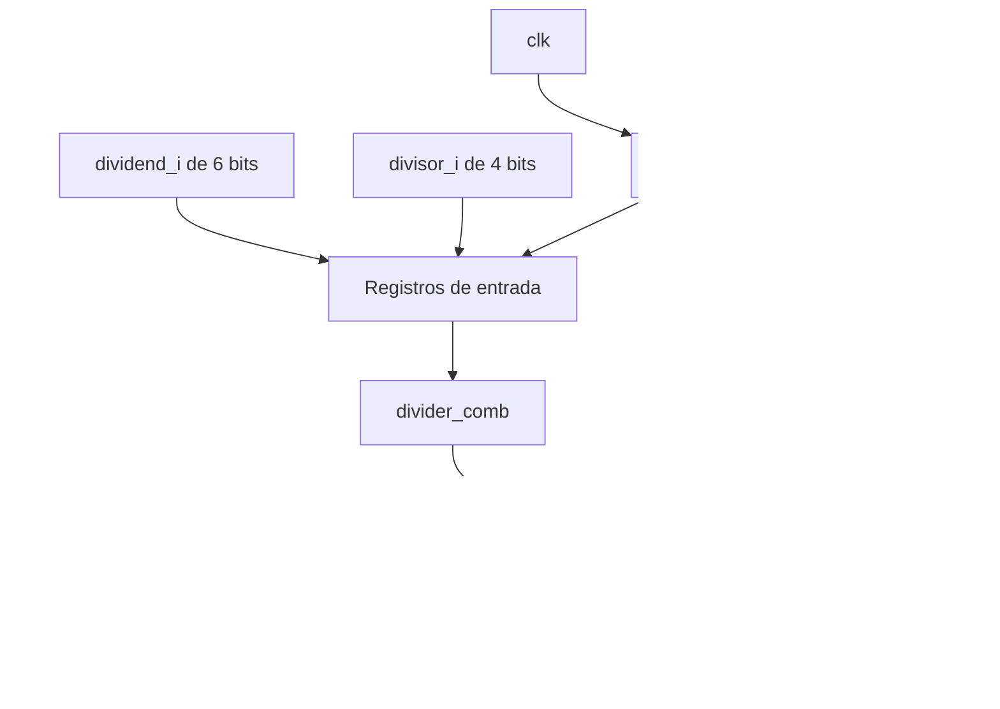
```mermaid
flowchart TD
    CLK["clk"] --> CORE["divider_core"]
    RST["rst_n"] --> CORE
    VALID["valid_i"] --> CORE
    A["dividend_i de 6 bits"] --> INREG["Registros de entrada"]
    B["divisor_i de 4 bits"] --> INREG

    INREG --> COMB["divider_comb"]
    COMB --> OUTREG["Registros de salida"]

    OUTREG --> Q["quotient_o de 6 bits"]
    OUTREG --> R["remainder_o de 4 bits"]
    OUTREG --> Z["div_zero_o"]
    OUTREG --> D["done_o"]

    CORE --> INREG
    CORE --> OUTREG
```
El módulo divider_core encapsula el divisor combinacional divider_comb dentro de una interfaz sincrónica. Cuando valid_i se activa, el módulo registra las entradas dividend_i y divisor_i. Luego utiliza divider_comb para obtener el cociente, residuo y bandera de división entre cero. En el siguiente ciclo de reloj, registra las salidas quotient_o, remainder_o y div_zero_o, y activa done_o para indicar que el resultado está estable. Este diseño permite que el subsistema de división tenga una interfaz controlada por valid/done, cumpliendo con el flujo de datos registrado requerido para los subsistemas del proyecto.


## Apendices:
### Apendice 1:
texto, imágen, etc
