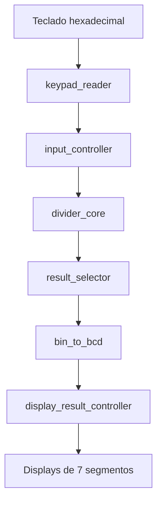
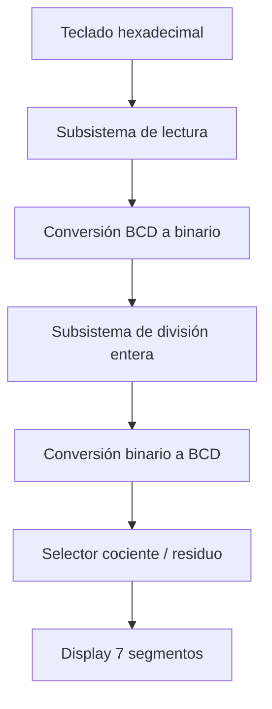
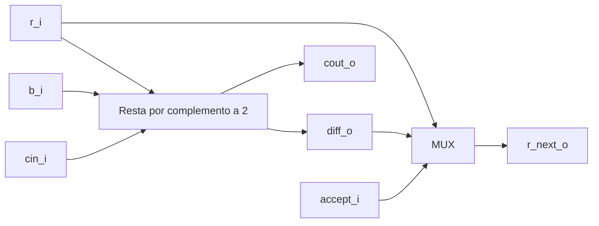
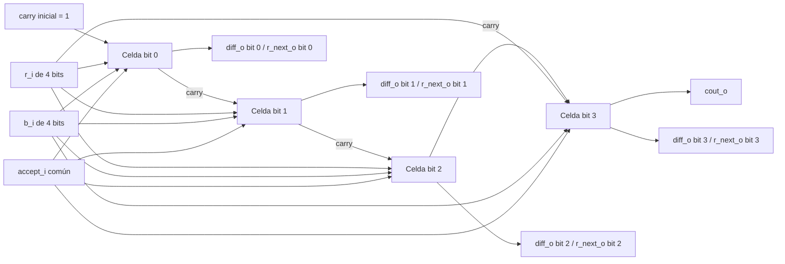
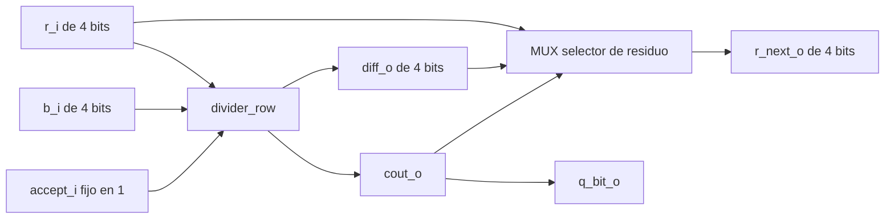
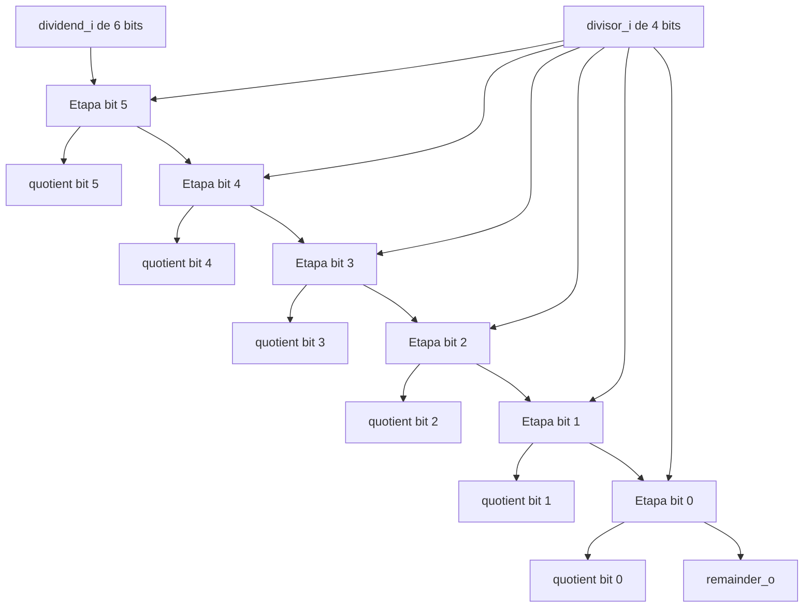
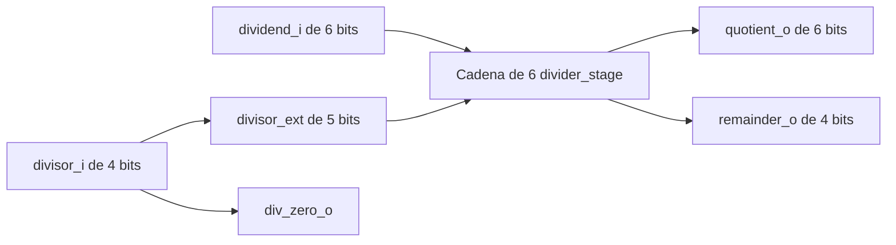
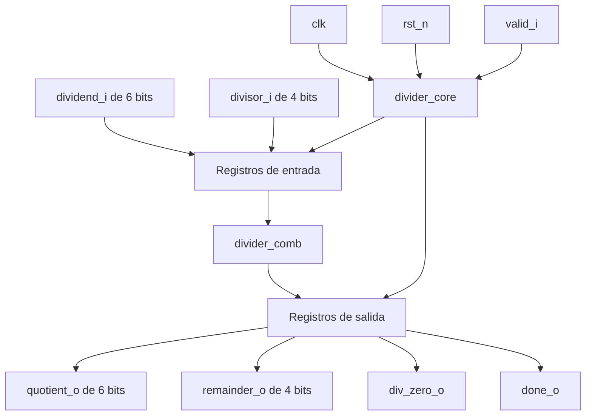

# Nombre del proyecto

## 1. Abreviaturas y definiciones

* **FPGA (Field Programmable Gate Array):** Dispositivo lógico programable que permite implementar circuitos digitales mediante la configuración de bloques lógicos internos y recursos de interconexión.

* **SystemVerilog:** Lenguaje de descripción y verificación de hardware utilizado para modelar, simular e implementar los módulos desarrollados para el proyecto.

* **FSM (Finite State Machine):** Máquina de estados finitos utilizada para controlar la secuencia de operaciones y el flujo de datos dentro de un sistema digital.

* **Dividendo:** Número que será dividido durante la operación de división entera.

* **Divisor:** Número por el cual se divide el dividendo para obtener el cociente y el residuo.

* **Cociente:** Resultado entero obtenido al realizar una división.

* **Residuo:** Cantidad restante después de efectuar una división entera, cumpliendo que su valor es menor que el divisor.

* **Ruta crítica:** Camino combinacional más largo dentro de un circuito digital, el cual determina la frecuencia máxima de funcionamiento del sistema.

* **Multiplexor (MUX):** Circuito combinacional que selecciona una de varias entradas y la conecta a una única salida según una señal de control.

* **Flip-Flop (FF):** Elemento secuencial capaz de almacenar un bit de información sincronizado con una señal de reloj.

* **Tang Nano 9K:** Tarjeta de desarrollo FPGA utilizada para la implementación física y validación experimental del diseño.

* **Testbench:** Entorno de simulación utilizado para verificar el correcto funcionamiento de un módulo digital mediante la aplicación de estímulos y la observación de sus respuestas.


## 2. Referencias
[0] David Harris y Sarah Harris. *Digital Design and Computer Architecture. RISC-V Edition.* Morgan Kaufmann, 2022. ISBN: 978-0-12-820064-3

## 3. Introducción 
El diseño de sistemas digitales modernos requiere la implementación eficiente de algoritmos mediante circuitos lógicos secuenciales y combinacionales. A diferencia del software, donde las operaciones se ejecutan de forma secuencial por un procesador, en los sistemas digitales es necesario diseñar explícitamente la ruta de datos y la lógica de control que permitan realizar cada operación de manera correcta y sincronizada con una señal de reloj.

En este proyecto se desarrolla una unidad de división entera sin signo capaz de calcular el cociente y el residuo a partir de un dividendo de hasta 6 bits y un divisor de hasta 4 bits. La implementación se realiza utilizando SystemVerilog sobre una FPGA Tang Nano 9K, siguiendo los principios fundamentales del diseño digital sincrónico. El sistema integra diferentes subsistemas encargados de la lectura de datos desde un teclado hexadecimal, la conversión entre formatos numéricos, la ejecución del algoritmo de división y el despliegue de resultados en displays de siete segmentos.

La unidad de división se basa en el algoritmo iterativo de división presentado en el curso, el cual realiza una secuencia de restas parciales para determinar los bits del cociente y actualizar el residuo en cada etapa. Para garantizar un funcionamiento ordenado y facilitar la comunicación entre bloques, el diseño emplea señales de control tipo valid y done, además de registros que sincronizan el flujo de datos entre los diferentes subsistemas.

El desarrollo del proyecto permite aplicar conceptos fundamentales de diseño lógico, tales como máquinas de estados finitos (FSM), rutas de datos, diseño modular, verificación mediante simulación y análisis de temporización. Asimismo, proporciona experiencia práctica en la implementación de algoritmos aritméticos sobre hardware reconfigurable, considerando tanto aspectos funcionales como restricciones de rendimiento y utilización de recursos dentro de la FPGA.

## 4. Definición del problema y objetivos

### 4.1 Definición del problema

La implementación de operaciones aritméticas en hardware representa un desafío importante dentro del diseño de sistemas digitales, ya que requiere transformar algoritmos matemáticos en estructuras lógicas capaces de operar de forma sincronizada y eficiente. Entre estas operaciones, la división entera es particularmente relevante debido a que involucra múltiples etapas de cálculo y control, a diferencia de operaciones más simples como la suma o la resta.

El problema planteado en este proyecto consiste en diseñar e implementar una unidad de división entera sin signo capaz de recibir un dividendo decimal representable con un máximo de 6 bits y un divisor decimal representable con un máximo de 4 bits. El sistema debe calcular el cociente y el residuo de la operación utilizando el algoritmo de división estudiado en el curso, garantizando además una correcta interacción entre los diferentes subsistemas encargados de la captura de datos, el procesamiento y el despliegue de resultados.

La solución debe cumplir con los principios de diseño digital sincrónico, empleando registros, señales de control y una interfaz de comunicación basada en las señales *valid* y *done* para coordinar el flujo de datos entre módulos. Asimismo, el sistema debe ser implementado y verificado en una FPGA Tang Nano 9K utilizando SystemVerilog.

### 4.2 Objetivo general

Diseñar e implementar una unidad de división entera sin signo en una FPGA Tang Nano 9K, capaz de calcular el cociente y el residuo de una operación de división mediante el uso de SystemVerilog y técnicas de diseño digital sincrónico.

### 4.3 Objetivos específicos

* Implementar el algoritmo iterativo de división entera estudiado en el curso para obtener el cociente y el residuo de una operación aritmética.

* Diseñar una ruta de datos que permita realizar las operaciones de resta, desplazamiento y almacenamiento requeridas por el algoritmo de división.

* Implementar la lógica de control necesaria para coordinar el funcionamiento de los diferentes subsistemas mediante señales de control y sincronización.

* Integrar los módulos de lectura de datos, conversión numérica, división y despliegue dentro de un sistema digital completo.

* Verificar el correcto funcionamiento de cada módulo y del sistema integrado mediante testbenches y simulaciones funcionales.

* Analizar el consumo de recursos y el desempeño temporal del diseño implementado en la FPGA.

* Desplegar el cociente y el residuo obtenidos en displays de siete segmentos mediante los módulos de conversión y visualización desarrollados.

### 5.0 Descripción general del sistema

El sistema desarrollado implementa una unidad de división entera sin signo sobre una FPGA Tang Nano 9K. Su función principal consiste en recibir un dividendo y un divisor desde un teclado hexadecimal, ejecutar la operación de división y desplegar en displays de siete segmentos el cociente o el residuo obtenido.

El flujo de operación inicia en el módulo de lectura del teclado, el cual realiza el barrido de las filas, sincroniza las señales provenientes de las columnas y genera un código hexadecimal de 4 bits junto con una señal de validación. Posteriormente, el módulo de control de entrada interpreta las teclas ingresadas por el usuario y construye los valores correspondientes al dividendo y al divisor en formato binario.

Durante la captura de datos, las teclas numéricas de 0 a 9 son utilizadas para ingresar los dígitos decimales. La tecla `#`, codificada internamente como `4'hF`, se utiliza para confirmar la entrada actual y avanzar al siguiente paso del proceso. La tecla `*`, codificada como `4'hE`, permite borrar la información almacenada y reiniciar la captura de datos.

Una vez ingresados el dividendo y el divisor, el módulo de control genera una señal `valid` que inicia la operación de división dentro del subsistema `divider_core`. Este bloque encapsula un divisor combinacional basado en etapas sucesivas de resta y selección de residuo, entregando como resultado el cociente, el residuo y una señal `done` que indica que el resultado es válido y estable.

Después de completarse la división, el sistema permite visualizar el cociente o el residuo mediante una señal de selección. La tecla `D`, codificada como `4'hD`, conmuta entre ambas visualizaciones una vez que el resultado se encuentra disponible.

Finalmente, el resultado seleccionado se convierte a formato BCD y se envía al subsistema de despliegue, el cual utiliza multiplexado para controlar cuatro displays de siete segmentos. Mientras la división no haya finalizado, el sistema muestra el valor que el usuario se encuentra ingresando; cuando la operación concluye, se despliega automáticamente el resultado calculado.

El diseño se compone de los siguientes módulos principales:

| Módulo                         | Función principal                                                                                                      |
| ------------------------------ | ---------------------------------------------------------------------------------------------------------------------- |
| `keypad_reader.sv`             | Realiza el barrido del teclado hexadecimal, sincroniza las entradas y genera las señales `key_value` y `key_valid`.    |
| `input_controller.sv`          | Controla la captura del dividendo y divisor, valida los límites permitidos y genera la señal de inicio de la división. |
| `divider_cell.sv`              | Implementa la celda elemental de resta y selección utilizada por el divisor.                                           |
| `divider_row.sv`               | Construye una fila completa de resta mediante varias celdas `divider_cell` conectadas en cascada.                      |
| `divider_stage.sv`             | Ejecuta una etapa del algoritmo de división y genera un bit del cociente junto con el nuevo residuo parcial.           |
| `divider_comb.sv`              | Implementa el divisor combinacional completo utilizando varias etapas de división conectadas secuencialmente.          |
| `divider_core.sv`              | Encapsula el divisor combinacional dentro de una interfaz sincrónica basada en las señales `valid` y `done`.           |
| `result_selector.sv`           | Selecciona entre mostrar el cociente o el residuo calculado.                                                           |
| `bin_to_bcd.sv`                | Convierte los resultados binarios a formato BCD para su despliegue decimal.                                            |
| `display_hex_decoder.sv`       | Convierte cada dígito BCD en el patrón correspondiente para un display de siete segmentos.                             |
| `display_mux4.sv`              | Realiza el multiplexado de los cuatro displays.                                                                        |
| `display_result_controller.sv` | Coordina la selección, conversión y despliegue de los datos mostrados al usuario.                                      |
| `system_top.sv`                | Módulo superior que integra todos los subsistemas y coordina el flujo completo de operación.                           |

La Figura X muestra el diagrama general de interconexión del sistema desarrollado.


```mermaid
flowchart TD
    A[Teclado hexadecimal]
    B[keypad_reader]
    C[input_controller]
    D[divider_core]
    E[result_selector]
    F[bin_to_bcd]
    G[display_result_controller]
    H[Displays de 7 segmentos]

    A --> B
    B --> C
    C --> D
    D --> E
    E --> F
    F --> G
    G --> H
```

**Figura X.** Diagrama general de bloques del sistema de división entera implementado.


## 3. Desarrollo

### 3.0 Descripción general del sistema

### 3.1 Módulo 1
#### 1. Encabezado del módulo
```SystemVerilog
module mi_modulo(
    input logic     entrada_i,      
    output logic    salida_i 
    );
```
#### 2. Parámetros
- Lista de parámetros

#### 3. Entradas y salidas:
- `entrada_i`: descripción de la entrada
- `salida_o`: descripción de la salida

#### 4. Criterios de diseño
Diagramas, texto explicativo...

#### 5. Testbench
Descripción y resultados de las pruebas hechas

### Otros modulos
- agregar informacion siguiendo el ejemplo anterior.


## 4. Consumo de recursos

## 5. Problemas encontrados durante el proyecto

## Diagramas para informe

**Diagrama general**

```mermaid
flowchart TD
    A[Teclado hexadecimal] --> B[Subsistema de lectura]
    B --> C[Conversión BCD a binario]
    C --> D[Subsistema de división entera]
    D --> E[Conversión binario a BCD]
    E --> F[Selector cociente / residuo]
    F --> G[Display 7 segmentos]
```

**Diagrama divider_cell**

```mermaid
flowchart LR
    A[r_i] --> S[Resta por complemento a 2]
    B[b_i] --> S
    C[cin_i] --> S

    S --> D[diff_o]
    S --> E[cout_o]

    A --> M[MUX]
    D --> M
    F[accept_i] --> M
    M --> G[r_next_o]
```
Celda básica de 1 bit que realiza una resta por complemento a dos y selecciona entre el resultado calculado o el residuo original según accept_i.

**Diaframa divider_row**

```mermaid
flowchart LR
    START["carry inicial = 1"] --> C0["Celda bit 0"]
    C0 -->|"carry"| C1["Celda bit 1"]
    C1 -->|"carry"| C2["Celda bit 2"]
    C2 -->|"carry"| C3["Celda bit 3"]
    C3 --> COUT["cout_o"]

    RI["r_i de 4 bits"] --> C0
    RI --> C1
    RI --> C2
    RI --> C3

    BI["b_i de 4 bits"] --> C0
    BI --> C1
    BI --> C2
    BI --> C3

    ACC["accept_i común"] --> C0
    ACC --> C1
    ACC --> C2
    ACC --> C3

    C0 --> D0["diff_o bit 0 / r_next_o bit 0"]
    C1 --> D1["diff_o bit 1 / r_next_o bit 1"]
    C2 --> D2["diff_o bit 2 / r_next_o bit 2"]
    C3 --> D3["diff_o bit 3 / r_next_o bit 3"]
```
Fila de 4 bits construida a partir de varias celdas divider_cell conectadas en cascada, donde el acarreo se propaga entre celdas y se obtiene una resta completa del residuo parcial contra el divisor.

**Diagrama divider_stage**

```mermaid
flowchart LR
    RI["r_i de 4 bits"] --> ROW["divider_row"]
    BI["b_i de 4 bits"] --> ROW
    ACC["accept_i fijo en 1"] --> ROW

    ROW --> DIFF["diff_o de 4 bits"]
    ROW --> COUT["cout_o"]

    RI --> MUX["MUX selector de residuo"]
    DIFF --> MUX
    COUT --> MUX

    MUX --> RNEXT["r_next_o de 4 bits"]

    COUT --> QBIT["q_bit_o"]
```
divider_stage representa una etapa de decisión del divisor. Internamente utiliza divider_row para intentar restar el divisor al residuo parcial, forzando accept_i en 1 para obtener el resultado de la resta. Luego, el acarreo final cout_o se utiliza como señal de decisión: si cout_o es 1, la resta fue válida y se acepta diff_o como nuevo residuo; si cout_o es 0, la resta no fue válida y se conserva el residuo anterior r_i. Esta misma señal se entrega como q_bit_o, correspondiente al bit del cociente generado por la etapa.

**Diagrama divisor completo**

```mermaid
flowchart TD
    A["dividend_i de 6 bits"] --> S5["Etapa bit 5"]
    B["divisor_i de 4 bits"] --> S5
    S5 --> Q5["quotient bit 5"]
    S5 --> S4["Etapa bit 4"]

    B --> S4
    S4 --> Q4["quotient bit 4"]
    S4 --> S3["Etapa bit 3"]

    B --> S3
    S3 --> Q3["quotient bit 3"]
    S3 --> S2["Etapa bit 2"]

    B --> S2
    S2 --> Q2["quotient bit 2"]
    S2 --> S1["Etapa bit 1"]

    B --> S1
    S1 --> Q1["quotient bit 1"]
    S1 --> S0["Etapa bit 0"]

    B --> S0
    S0 --> Q0["quotient bit 0"]
    S0 --> R["remainder_o"]
```

**Diagrama divider_comb**

```mermaid
flowchart LR
    A["dividend_i de 6 bits"] --> B["Cadena de 6 divider_stage"]
    D["divisor_i de 4 bits"] --> E["divisor_ext de 5 bits"]
    E --> B
    B --> Q["quotient_o de 6 bits"]
    B --> R["remainder_o de 4 bits"]
    D --> Z["div_zero_o"]
```
El módulo divider_comb implementa un divisor combinacional sin signo para un dividendo de 6 bits y un divisor de 4 bits. Internamente utiliza seis módulos divider_stage conectados en secuencia, uno por cada bit del dividendo, desde el bit más significativo hasta el menos significativo. En cada etapa se genera un bit del cociente y se actualiza el residuo parcial. El divisor se extiende a 5 bits para permitir la operación de resta con el residuo desplazado. Finalmente, los bits q5 a q0 se agrupan para formar quotient_o, el residuo final se entrega como remainder_o y se incluye una señal div_zero_o para detectar división entre cero.

**Diagrama divider_core**

```mermaid
flowchart TD
    CLK["clk"] --> CORE["divider_core"]
    RST["rst_n"] --> CORE
    VALID["valid_i"] --> CORE
    A["dividend_i de 6 bits"] --> INREG["Registros de entrada"]
    B["divisor_i de 4 bits"] --> INREG

    INREG --> COMB["divider_comb"]
    COMB --> OUTREG["Registros de salida"]

    OUTREG --> Q["quotient_o de 6 bits"]
    OUTREG --> R["remainder_o de 4 bits"]
    OUTREG --> Z["div_zero_o"]
    OUTREG --> D["done_o"]

    CORE --> INREG
    CORE --> OUTREG
```
El módulo divider_core encapsula el divisor combinacional divider_comb dentro de una interfaz sincrónica. Cuando valid_i se activa, el módulo registra las entradas dividend_i y divisor_i. Luego utiliza divider_comb para obtener el cociente, residuo y bandera de división entre cero. En el siguiente ciclo de reloj, registra las salidas quotient_o, remainder_o y div_zero_o, y activa done_o para indicar que el resultado está estable. Este diseño permite que el subsistema de división tenga una interfaz controlada por valid/done, cumpliendo con el flujo de datos registrado requerido para los subsistemas del proyecto.


## Apendices:
### Apendice 1:
texto, imágen, etc
