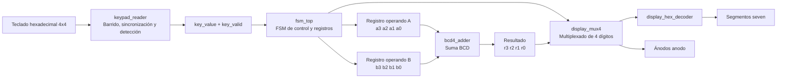
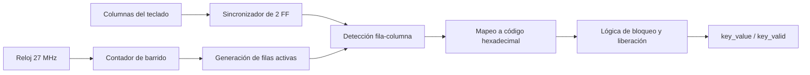
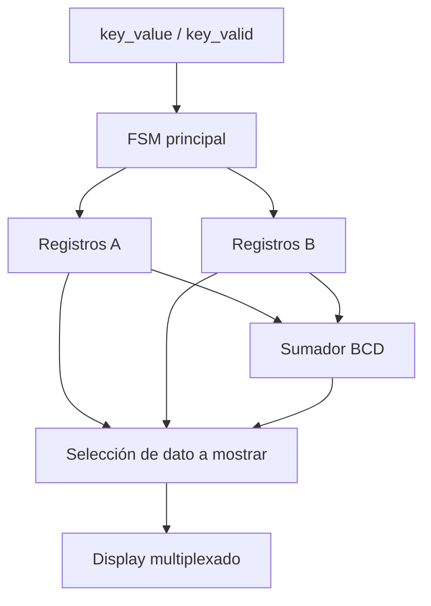
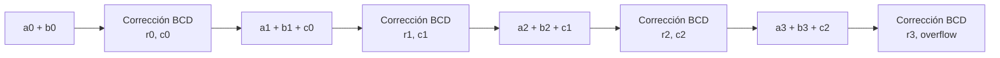
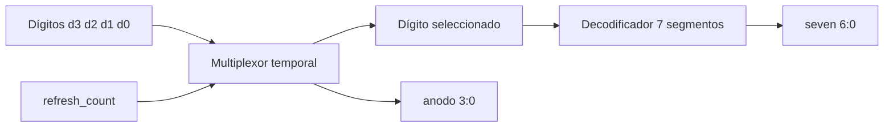
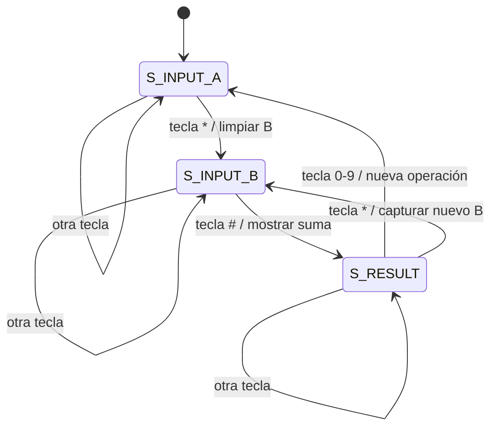

# Proyecto II: Diseño digital sincrónico en HDL

## 1. Abreviaturas y definiciones

- **FPGA**: *Field Programmable Gate Array*, dispositivo lógico programable utilizado para implementar sistemas digitales.
- **HDL**: *Hardware Description Language*, lenguaje usado para describir hardware digital.
- **SystemVerilog**: lenguaje de descripción de hardware utilizado para implementar el diseño.
- **FSM**: *Finite State Machine* o máquina de estados finitos. Se utiliza para controlar la secuencia de operación del sistema.
- **BCD**: *Binary Coded Decimal*. Representación en la cual cada dígito decimal se almacena por separado en 4 bits.
- **Debounce**: técnica para eliminar rebotes mecánicos de una tecla o interruptor.
- **Multiplexado**: técnica que permite controlar varios displays utilizando una ruta de datos compartida y activando un display a la vez.
- **Tang Nano 9K**: tarjeta FPGA utilizada para implementar el sistema.

## 2. Referencias

[1] Pong P. Chu. *FPGA Prototyping by SystemVerilog Examples*. Xilinx MicroBlaze MCS SoC Edition. Wiley, 2018.

[2] Andrew House. *Hex Keypad Explanation*. Noviembre de 2009. Disponible en: https://www-ug.eecg.toronto.edu/msl/nios_devices/datasheets/hex_expl.pdf

[3] David Medina. *Video tutorial para principiantes. Flujo abierto para TangNano 9K*. Julio de 2024. Disponible en: https://www.youtube.com/watch?v=AKO-SaOM7BA

[4] David Medina. *Wiki tutorial sobre el uso de la TangNano 9K y el flujo abierto de herramientas*. Mayo de 2024. Disponible en: https://github.com/DJosueMM/open_source_fpga_environment/wiki

[5] William James Dally y R. Curtis Harting. *Digital Design: A Systems Approach*. Cambridge University Press, 2012.

## 3. Introducción

El presente proyecto consiste en el diseño e implementación de un sistema digital sincrónico en una FPGA Tang Nano 9K utilizando SystemVerilog. El sistema permite capturar datos desde un teclado hexadecimal, almacenar dos números decimales positivos, realizar la suma aritmética de ambos y mostrar el resultado en cuatro displays de 7 segmentos.

El diseño se desarrolló siguiendo una organización modular. Cada bloque cumple una función específica dentro del sistema: lectura del teclado, sincronización de señales externas, control mediante una FSM, almacenamiento de dígitos, suma BCD y despliegue multiplexado. Esta separación facilita la verificación individual de los subsistemas y permite analizar con mayor claridad el flujo de datos desde la entrada física hasta la salida visual.

## 4. Definición del problema y objetivos

El problema planteado consiste en diseñar un circuito digital sincrónico capaz de capturar dos números enteros positivos desde un teclado hexadecimal, procesarlos dentro de la FPGA y desplegar la suma sin signo en cuatro displays de 7 segmentos. El sistema debe operar con el reloj de 27 MHz de la Tang Nano 9K y debe considerar la sincronización de señales externas, ya que las entradas provenientes del teclado no están originalmente alineadas con el reloj interno del sistema.

### Objetivo general

Implementar un sistema digital sincrónico en SystemVerilog que capture dos números desde un teclado hexadecimal, realice su suma en formato decimal y muestre el resultado en displays de 7 segmentos.

### Objetivos específicos

- Leer un teclado hexadecimal mediante barrido de filas y lectura de columnas.
- Sincronizar las señales externas del teclado con el reloj interno de la FPGA.
- Reducir el efecto del rebote mecánico mediante una lógica de bloqueo y espera de liberación de tecla.
- Controlar la captura de los operandos mediante una máquina de estados finitos.
- Almacenar los dígitos ingresados en registros internos.
- Implementar una suma BCD de cuatro dígitos.
- Multiplexar cuatro displays de 7 segmentos para mostrar el número que se está ingresando o el resultado.
- Validar el funcionamiento del sistema mediante testbenches en SystemVerilog.

## 5. Descripción general del sistema

El sistema completo recibe como entrada las columnas de un teclado hexadecimal y genera como salida las señales de filas para el barrido del teclado, las señales de segmentos del display y las señales de selección de ánodo. El flujo de operación inicia con el módulo de lectura del teclado, el cual detecta una tecla presionada y entrega un código de 4 bits junto con una señal de validación. Luego, la FSM interpreta ese código y decide si debe almacenarse como parte del primer número, como parte del segundo número o si debe mostrarse el resultado.

El sistema utiliza la tecla `*`, codificada internamente como `4'hE`, para pasar de la entrada del primer número a la entrada del segundo número. La tecla `#`, codificada como `4'hF`, se utiliza para solicitar la visualización del resultado. Las teclas numéricas de `0` a `9` se almacenan como dígitos BCD.

El diseño se compone de los siguientes módulos principales:

1. `keypad_reader.sv`: realiza el barrido del teclado, sincroniza las columnas y genera `key_value` y `key_valid`.
2. `fsm_top.sv`: integra la lectura del teclado, la FSM de control, los registros de operandos, el sumador y el display.
3. `bcd4_adder.sv`: realiza la suma decimal de cuatro dígitos BCD.
4. `display_mux4.sv`: multiplexa los cuatro dígitos hacia los displays de 7 segmentos.
5. `display_hex_decoder.sv`: convierte cada dígito de 4 bits en el patrón correspondiente de 7 segmentos.
6. `system_top.sv`: versión alternativa del sistema superior donde la lógica de suma está integrada directamente dentro del módulo superior.

## 6. Criterio de diseño

El diseño se realizó de forma modular para separar claramente la ruta de datos y la lógica de control. Esta decisión permite probar cada subsistema por separado y facilita la depuración del proyecto. En lugar de implementar todo el comportamiento en un único bloque, se dividió el sistema en lectura de teclado, control de estados, suma y visualización.

La captura de datos se implementó mediante una FSM porque el sistema no solo debe leer teclas, sino también interpretar el contexto en el que se presionan. Por ejemplo, una tecla numérica puede pertenecer al primer operando, al segundo operando o puede iniciar una nueva operación después de mostrar el resultado. La FSM permite definir este comportamiento de forma ordenada y sin ambigüedad.

Las señales del teclado son externas a la FPGA y, por tanto, asíncronas respecto al reloj interno. Por esta razón, las columnas se registran mediante dos flip-flops antes de ser utilizadas por la lógica principal. Esto reduce el riesgo de problemas de metaestabilidad. Además, se implementa una lógica de bloqueo que evita registrar repetidamente la misma tecla mientras permanece presionada.

La suma se realiza en formato BCD porque los datos ingresados y mostrados son decimales. Cada dígito se almacena de forma independiente en 4 bits, lo cual simplifica el despliegue en los displays de 7 segmentos y evita tener que convertir un número binario completo a decimal antes de mostrarlo.

El despliegue se implementó con multiplexado porque los cuatro displays comparten las mismas señales de segmentos. El sistema activa un ánodo a la vez y cambia rápidamente entre los cuatro dígitos, generando la percepción visual de que todos están encendidos al mismo tiempo.

## 7. Subsistema de lectura del teclado hexadecimal

El módulo `keypad_reader` se encarga de leer el teclado hexadecimal de matriz 4x4. Para hacerlo, genera un barrido sobre las filas mediante la señal `filas[3:0]` y lee el estado de las columnas mediante `columnas[3:0]`.

El teclado se trabaja con lógica activa en bajo. En reposo, las columnas se mantienen en `4'hF`. Cuando se presiona una tecla, una de las columnas cambia a cero durante la fila que está siendo activada. Con la combinación de fila activa y columna detectada se determina cuál tecla fue presionada.

### Funcionamiento interno

El módulo contiene:

- Un contador `scan_cnt` que define el tiempo durante el cual se mantiene activa cada fila.
- Un índice `fila_index` que selecciona cuál fila se activa.
- Dos registros `columnas_ff1` y `columnas_sync` para sincronizar las entradas del teclado.
- Una lógica combinacional que traduce la combinación fila-columna a un código hexadecimal.
- Una señal `key_valid` que se activa durante un ciclo de reloj cuando se detecta una tecla válida.
- Una señal `locked` que evita múltiples detecciones de una misma pulsación.
- Un contador `release_cnt` que espera un tiempo después de liberar la tecla antes de permitir una nueva lectura.

### Mapeo de teclas

El mapeo usado en el diseño es:

| Fila activa | Columna detectada | Tecla |
|---|---:|---:|
| `1110` | `1110` | `*` / `E` |
| `1110` | `1101` | `0` |
| `1110` | `1011` | `#` / `F` |
| `1110` | `0111` | `D` |
| `1101` | `1110` | `7` |
| `1101` | `1101` | `8` |
| `1101` | `1011` | `9` |
| `1101` | `0111` | `C` |
| `1011` | `1110` | `4` |
| `1011` | `1101` | `5` |
| `1011` | `1011` | `6` |
| `1011` | `0111` | `B` |
| `0111` | `1110` | `1` |
| `0111` | `1101` | `2` |
| `0111` | `1011` | `3` |
| `0111` | `0111` | `A` |

Para la operación principal del sistema se utilizan los dígitos `0` a `9`, la tecla `*` como separador entre operandos y la tecla `#` como instrucción para mostrar el resultado.

## 8. FSM de control principal

La máquina de estados principal se encuentra en `fsm_top.sv`. Su función es decidir qué debe hacerse con cada tecla válida generada por el módulo de teclado.

La FSM tiene tres estados:

1. `S_INPUT_A`: captura el primer número.
2. `S_INPUT_B`: captura el segundo número.
3. `S_RESULT`: muestra el resultado de la suma.

### Estado `S_INPUT_A`

En este estado, las teclas numéricas se almacenan en los registros del primer operando `a3`, `a2`, `a1` y `a0`. Cada vez que se ingresa un nuevo dígito, los valores anteriores se desplazan hacia la izquierda:

```systemverilog
a3 <= a2;
a2 <= a1;
a1 <= a0;
a0 <= key_value;
```

Esto permite ingresar los números de manera similar a una calculadora. Por ejemplo, al presionar `1`, `2`, `3`, el número queda almacenado como `0123`.

Cuando se presiona `*`, la FSM pasa al estado `S_INPUT_B` y limpia los registros del segundo operando.

### Estado `S_INPUT_B`

En este estado, las teclas numéricas se almacenan en los registros `b3`, `b2`, `b1` y `b0`, usando el mismo esquema de desplazamiento. Si se presiona nuevamente `*`, se limpia el segundo operando. Si se presiona `#`, la FSM pasa a `S_RESULT`.

### Estado `S_RESULT`

En este estado, el sistema muestra la suma calculada por el sumador BCD. Si el usuario presiona una tecla numérica, el sistema inicia una nueva operación y regresa a `S_INPUT_A`, usando esa tecla como primer dígito del nuevo operando. Si se presiona `*`, se pasa nuevamente a captura del segundo operando.

## 9. Subsistema de suma aritmética

La suma se implementa en el módulo `bcd4_adder.sv`. Este bloque recibe dos operandos de cuatro dígitos BCD:

- Primer operando: `a3`, `a2`, `a1`, `a0`.
- Segundo operando: `b3`, `b2`, `b1`, `b0`.

La salida corresponde al resultado de la suma:

- Resultado: `r3`, `r2`, `r1`, `r0`.
- Bandera: `overflow`.

El módulo suma primero las unidades, luego las decenas, centenas y millares. Cada dígito se corrige mediante la función `add_bcd_digit`, que convierte valores de 0 a 18 en un dígito decimal de 0 a 9 y un acarreo. De esta forma, si la suma de dos dígitos supera 9, se genera un carry hacia el siguiente dígito.

Por ejemplo:

- `4 + 6 = 10` produce dígito `0` y carry `1`.
- `9 + 9 = 18` produce dígito `8` y carry `1`.

Este criterio se eligió porque el sistema trabaja directamente con dígitos decimales individuales. Así se evita una conversión adicional entre binario y decimal para mostrar el resultado.

## 10. Subsistema de despliegue en 7 segmentos

El despliegue está formado por los módulos `display_mux4` y `display_hex_decoder`.

El módulo `display_mux4` recibe cuatro dígitos de 4 bits (`d3`, `d2`, `d1`, `d0`) y selecciona cuál de ellos se envía al decodificador de 7 segmentos. Para esto utiliza un contador `refresh_count`, del cual se toman los bits más significativos para seleccionar el dígito activo.

El módulo `display_hex_decoder` recibe un valor hexadecimal de 4 bits y entrega el patrón de segmentos correspondiente en la señal `seg[6:0]`. Aunque el decodificador permite mostrar valores de `0` a `F`, en la operación principal se utilizan principalmente valores decimales de `0` a `9`.

La selección de ánodos se realiza con lógica activa en bajo:

| Selector | Dígito mostrado | Ánodo activo |
|---|---|---:|
| `00` | `d3` | `1110` |
| `01` | `d2` | `1101` |
| `10` | `d1` | `1011` |
| `11` | `d0` | `0111` |

## 11. Diagramas de bloques

### 11.1 Diagrama general del sistema



### 11.2 Subsistema de lectura de teclado



### 11.3 Subsistema de control y registros



### 11.4 Subsistema de suma



### 11.5 Subsistema de despliegue



## 12. Diagrama de estados

La FSM principal puede representarse mediante el siguiente diagrama:



Este diagrama también debe incluirse en la bitácora, ya que representa el criterio de control usado para definir cuándo el sistema está capturando el primer número, el segundo número o mostrando el resultado.

## 13. Testbench y simulaciones

La verificación funcional del proyecto se realizó mediante testbenches individuales para los principales módulos del sistema. Los archivos de simulación se encuentran en la carpeta `src/sim`.

### 13.1 Testbench del sumador BCD

El archivo `tb_bcd4_adder.sv` verifica el módulo `bcd4_adder`. Se aplican diferentes combinaciones de operandos y se compara la salida obtenida con el resultado esperado.

Casos probados:

| Operando A | Operando B | Resultado esperado |
|---:|---:|---:|
| 1234 | 0456 | 1690 |
| 0999 | 0999 | 1998 |
| 0000 | 0000 | 0000 |
| 1111 | 2222 | 3333 |
| 5000 | 4000 | 9000 |

La simulación permite comprobar que el sumador maneja correctamente los acarreos entre dígitos decimales.

### 13.2 Testbench del multiplexor de display

El archivo `tb_display_mux4.sv` prueba el módulo `display_mux4`. Inicialmente se cargan los dígitos `1`, `2`, `3`, `4`, y luego se cambian por `9`, `8`, `7`, `6`. La simulación permite verificar que la señal `anodo` cambia periódicamente y que la salida `seven` corresponde al dígito seleccionado en cada instante.

### 13.3 Testbench del lector de teclado

El archivo `tb_keypad_reader.sv` valida el módulo `keypad_reader`. Para acelerar la simulación se modifican los parámetros `SCAN_DELAY` y `RELEASE_DELAY`. El testbench presiona virtualmente todas las teclas del teclado hexadecimal y comprueba que el módulo genera correctamente el código `key_value` y el pulso `key_valid`.

### 13.4 Testbench del sistema con FSM

El archivo `tb_fsm_top.sv` verifica el sistema integrado. Se simulan secuencias completas de entrada de datos:

| Secuencia simulada | Interpretación | Resultado esperado |
|---|---|---:|
| `1 2 3 4 * 4 5 6 #` | 1234 + 456 | 1690 |
| `9 9 9 * 9 9 9 #` | 999 + 999 | 1998 |

En este testbench, la tecla `*` se usa para pasar al segundo operando y la tecla `#` para mostrar el resultado. La verificación se realiza observando los registros internos `d3`, `d2`, `d1` y `d0`, los cuales representan los cuatro dígitos mostrados en los displays.

### Imágenes recomendadas para esta sección

Se recomienda incluir capturas de GTKWave donde se observen las siguientes señales:

- `clk` y `rst_n`.
- `filas` y `columnas`.
- `key_value` y `key_valid`.
- `state`.
- Registros `a3:a0` y `b3:b0`.
- Resultado `r3:r0`.
- Señales `seven` y `anodo`.

## 14. Consumo de recursos

En esta sección se debe colocar el reporte de síntesis generado por las herramientas del flujo abierto. Deben incluirse, como mínimo, la cantidad de LUTs, flip-flops y celdas utilizadas.

> Pendiente de completar con el reporte final de síntesis del proyecto.

Formato recomendado:

```text
Number of wires:      [completar]
Number of wire bits:  [completar]
Number of cells:      [completar]
DFF:                  [completar]
LUT1:                 [completar]
LUT2:                 [completar]
LUT3:                 [completar]
LUT4:                 [completar]
```

## 15. Velocidad máxima de reloj

El diseño fue planteado para funcionar con el reloj de 27 MHz de la Tang Nano 9K. Para validar este requisito, debe revisarse el reporte de temporización generado durante el proceso de place and route. El objetivo es comprobar que la frecuencia máxima soportada por el diseño sea mayor o igual a 27 MHz.

> Pendiente de completar con el reporte final de temporización.

Formato recomendado:

```text
Frecuencia requerida: 27 MHz
Frecuencia máxima reportada: [completar] MHz
Slack: [completar]
Conclusión: [cumple / no cumple]
```

## 16. Problemas encontrados y soluciones

Durante el desarrollo del sistema se identificaron varios puntos importantes:

1. **Lectura confiable del teclado**  
   Las señales del teclado son externas y pueden generar lecturas inestables. Para resolverlo se implementó sincronización de dos flip-flops y una lógica de bloqueo que espera la liberación de la tecla antes de permitir una nueva lectura.

2. **Evitar múltiples capturas por una sola pulsación**  
   Al mantener presionada una tecla, el sistema podía detectar la misma tecla más de una vez. Esto se resolvió usando la señal `locked` y el contador `release_cnt`.

3. **Definición del flujo de operación**  
   Era necesario distinguir cuándo una tecla numérica pertenecía al primer operando, al segundo operando o a una nueva operación. Para esto se implementó una FSM con tres estados: captura de A, captura de B y resultado.

4. **Representación decimal del resultado**  
   Como el sistema debe mostrar valores decimales en displays, se decidió usar una suma BCD por dígitos. Esta solución simplifica el despliegue y permite conservar cada dígito listo para enviarse al decodificador de 7 segmentos.

5. **Diferencia entre `system_top` y `fsm_top`**  
   Ambos módulos cumplen una función similar como módulo superior del sistema. Sin embargo, `fsm_top` organiza el control explícitamente mediante estados definidos (`S_INPUT_A`, `S_INPUT_B`, `S_RESULT`) e instancia el módulo `bcd4_adder`. En cambio, `system_top` integra más lógica directamente dentro del módulo superior usando banderas como `entering_B` y `show_result`. Para el informe se recomienda explicar `fsm_top` como la versión principal por ajustarse mejor al criterio de FSM solicitado.

## 17. Recomendaciones de imágenes para el informe y la bitácora

Para completar el informe y la bitácora se recomienda agregar las siguientes imágenes:

1. Diagrama general del sistema completo.
2. Diagrama del subsistema de lectura del teclado.
3. Diagrama del subsistema de suma BCD.
4. Diagrama del subsistema de despliegue multiplexado.
5. Diagrama de estados de la FSM principal.
6. Captura de GTKWave del testbench `tb_keypad_reader`.
7. Captura de GTKWave del testbench `tb_fsm_top` mostrando una suma completa.
8. Captura del reporte de recursos de síntesis.
9. Captura del reporte de temporización donde se confirme operación a 27 MHz.
10. Fotografía del montaje físico con teclado, FPGA y displays, si ya se tiene implementado.

## 18. Conclusiones

El proyecto permitió implementar un sistema digital sincrónico completo en una FPGA, integrando lectura de señales externas, control secuencial, almacenamiento de datos, suma aritmética y visualización en displays de 7 segmentos. La división modular facilitó la verificación del sistema, ya que cada bloque pudo probarse de manera independiente antes de integrarse en el módulo superior.

La FSM principal permitió controlar de forma clara el flujo de operación del sistema, diferenciando entre la captura del primer número, la captura del segundo número y la visualización del resultado. Además, el uso de registros y sincronización permitió adaptar las señales externas del teclado al dominio de reloj interno de la FPGA.

La implementación de la suma en formato BCD resultó adecuada para este proyecto, ya que los datos ingresados y desplegados son decimales. Esto simplificó la conexión entre la lógica aritmética y el subsistema de visualización. Finalmente, el uso de multiplexado permitió controlar cuatro displays de 7 segmentos utilizando una cantidad reducida de señales.

Como trabajo pendiente, se debe completar el informe con capturas reales de simulación, reporte de recursos, reporte de temporización y evidencia del montaje físico o pruebas en hardware.
